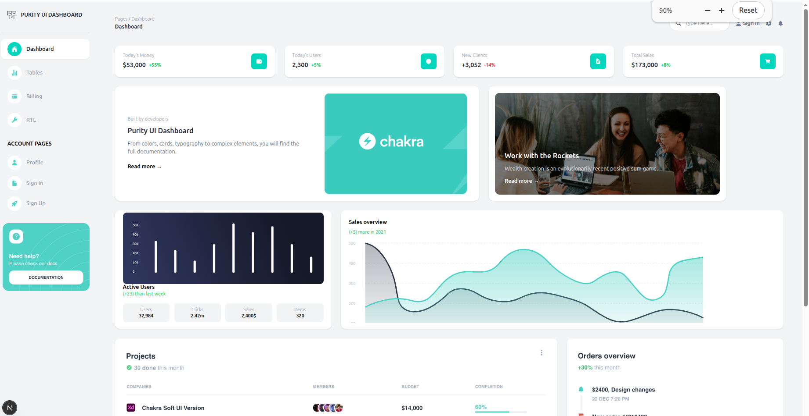
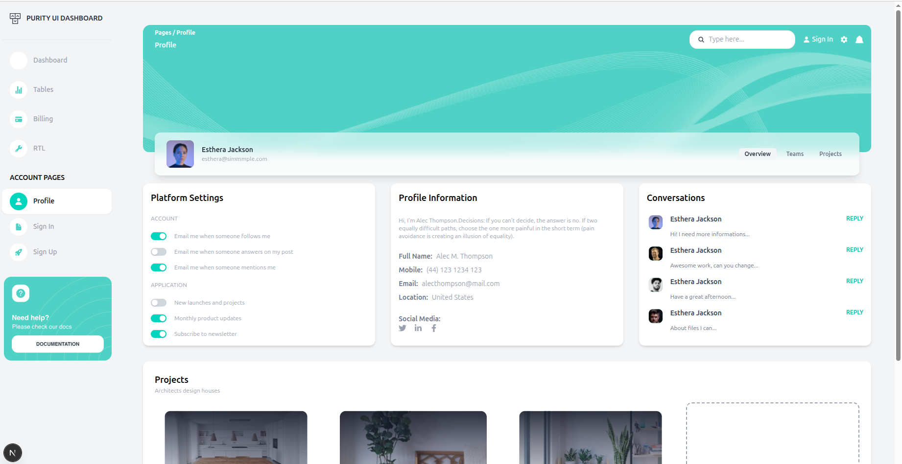

# Week 3 – Next.js + TailwindCSS Frontend Project

This project was built as part of **Week 3: Advanced Frontend Training**.
The goal was to build a **modern, production-grade UI** using **Next.js App Router** and **TailwindCSS**, without any backend.

---

##  Tech Stack

- Next.js (App Router)
- React
- TailwindCSS
- JavaScript
- Framer Motion (optional)

---

##  Screenshots

### Login Page


### Dashboard


### Profile Page


### Landing Page


---

##  Folder Structure

```bash
week3-next-tailwind-frontend/
│── app/
│   ├── layout.jsx
│   ├── page.jsx
│   ├── login/
│   │   └── page.jsx
│   └── dashboard/
│       ├── page.jsx
│       ├── profile/
│       │   └── page.jsx
│
│── components/
│   └── ui/
│       ├── Navbar.jsx
│       ├── Sidebar.jsx
│       ├── Button.jsx
│       ├── Card.jsx
│       ├── Input.jsx
│       ├── Badge.jsx
│       ├── Modal.jsx
│       └── index.js
│
│── public/
│── styles/
│── screenshots/
│── README.md


1. Reusable UI Components

The following reusable components were created inside /components/ui:

Navbar – Top navigation bar

Sidebar – Dashboard side navigation

Button – Reusable buttons with variants

Card – Used for stats, profile, and content sections

Input – Form inputs

Badge – Status labels

Modal – Popup UI

All components are reusable and accept props for flexibility.

2. Pages Implemented

/ – Landing Page

/login – Static Login Page

/dashboard – Dashboard UI

/dashboard/users – Users list (mock data)

/dashboard/profile – Profile page

All dashboard pages share a common layout using nested layouts.

3. Core Concepts Used

File-based routing using app/ directory

Root and nested layouts

Server and Client Components

use client for interactive components

Image optimization using next/image

SEO metadata using metadata config

Responsive UI using TailwindCSS

Component-based architecture

4. Lessons Learned

Understood the difference between Server Components and Client Components

Learned how Next.js layouts preserve UI state

Built a reusable component library

Improved understanding of responsive design

Learned how to structure a real-world frontend project

Gained confidence converting Figma designs to TailwindCSS